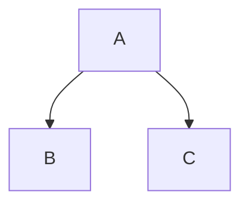
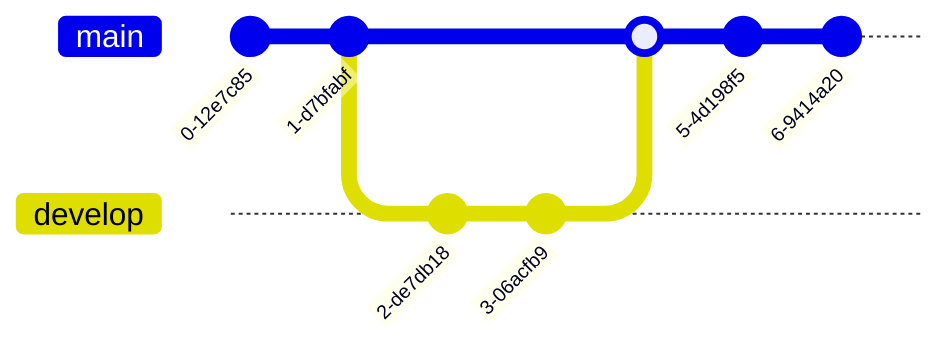
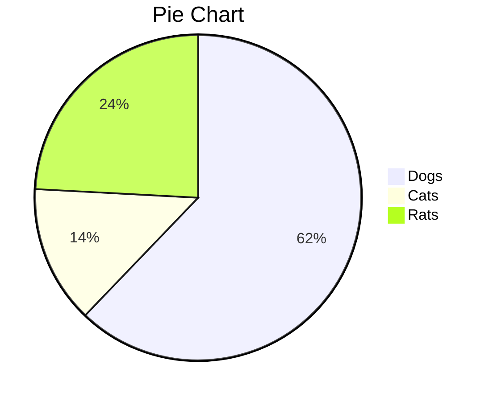
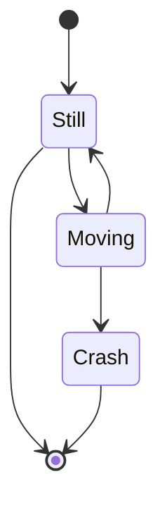
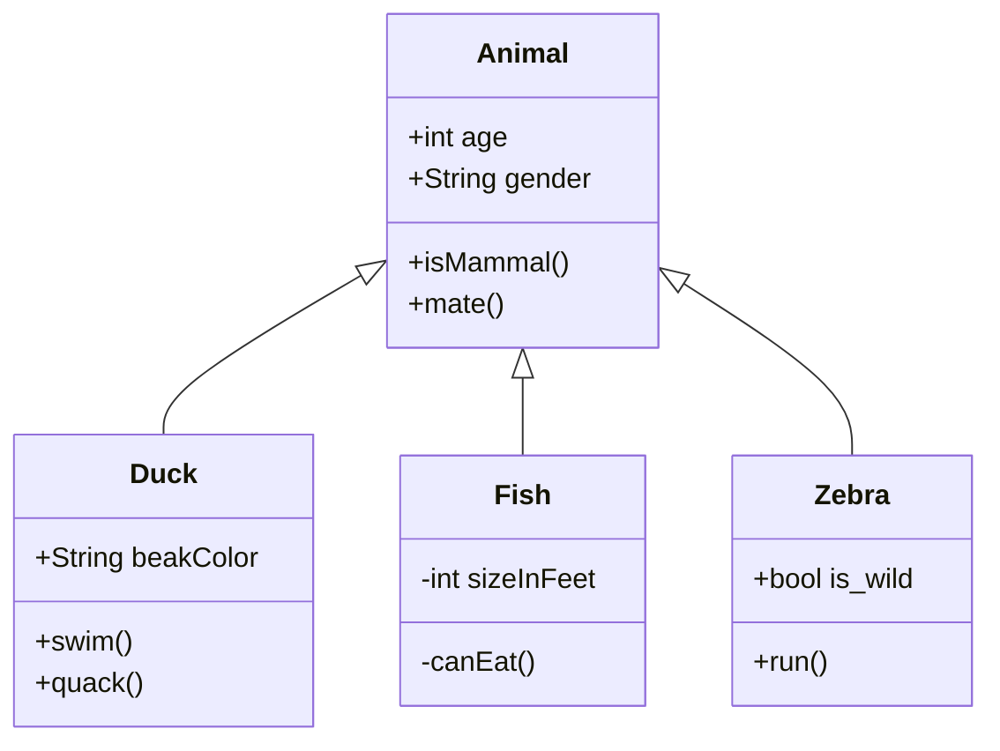
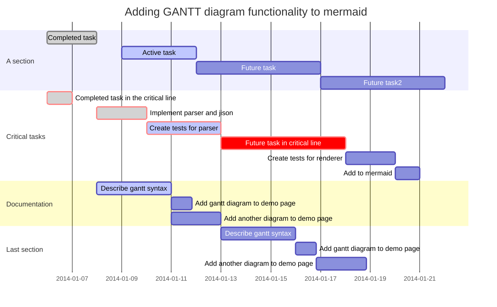

# Welcome to Markdown Studio

This is your local-first markdown power tool.

## Features
- **GFM Support**: Tables, task lists, and more.
- **Math**: $E=mc^2$
- **Code**: Highlighting via Shiki/Prism.
- **AI**: Integration with Gemini.

Start by creating a new note in the sidebar.

```python
import os
os.getcwd()
```

```json
{
   "Key":"Value"
}
```



> [!warning] Proceed with Caution 
> Proceed with Caution 

> [!info] Proceed with Caution 
> Proceed with Caution 







### AI Generated Summary
Markdown Studio is a local-first markdown editor featuring GFM support, LaTeX math, code highlighting, and Gemini AI integration. It supports advanced formatting, including diagrams and task lists, providing a professional environment for note management.

[Test Url](https://support.typora.io/Draw-Diagrams-With-Markdown/)

| Time | Temp 1 | Temp 2 |
|-------|--------|--------|
| 1     | 14.98  | 2      |
| 2     | 14.04  | 3      |
| 3     | 12.86  | 4      |
| 4     | 1.32   | 6      |

:dog:
:cat: